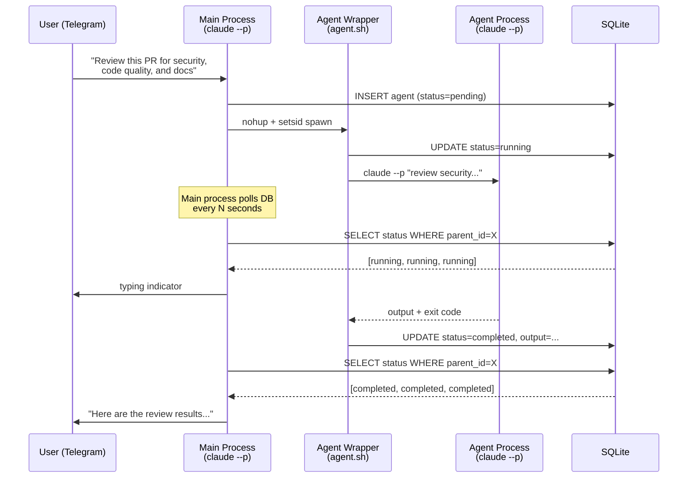
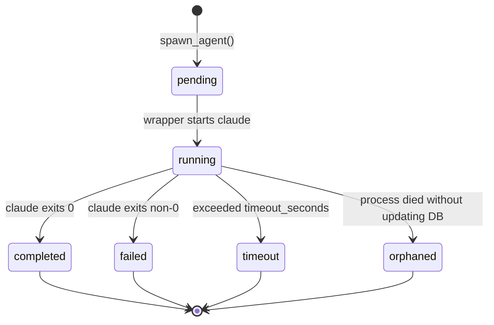
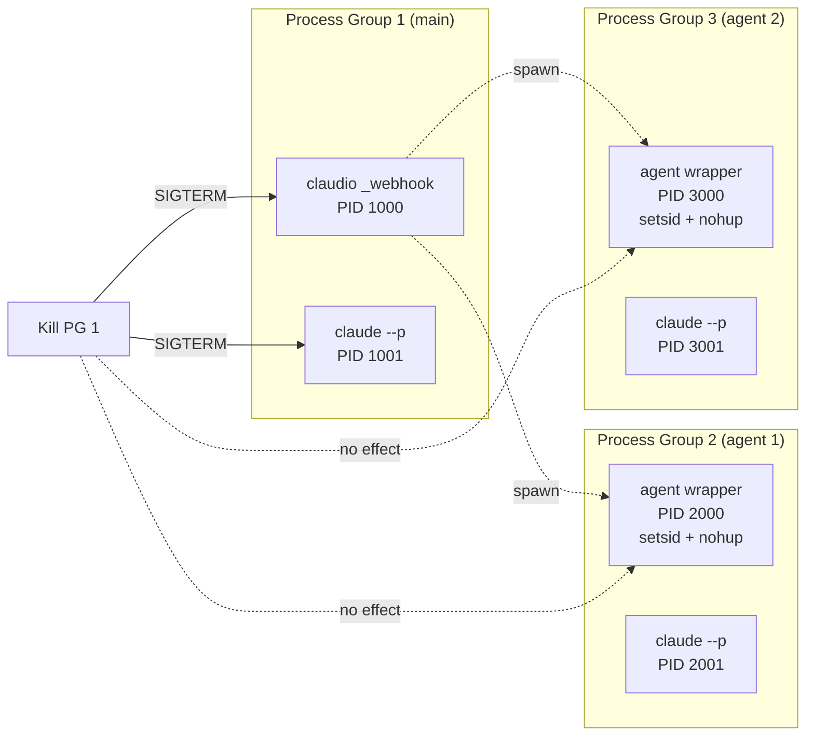
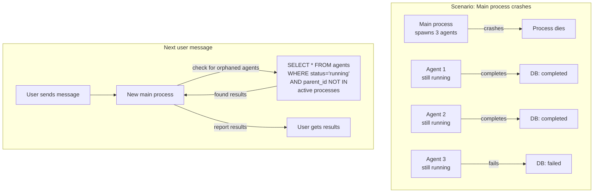
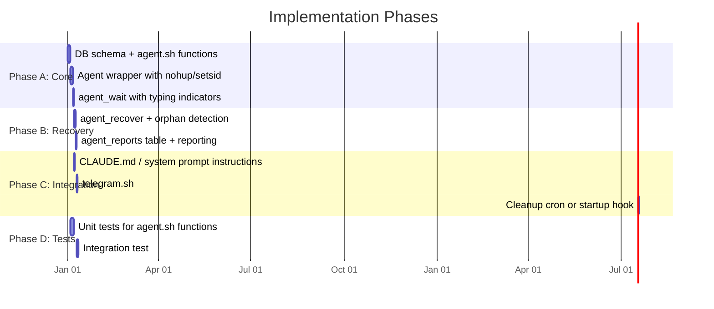

# Parallel Agents Plan

Specification and implementation plan for running parallel Claude agents as background
processes managed by Claudio, with state tracking in SQLite and crash recovery.

## Problem Statement

Claudio is invoked as a one-shot CLI (`claude --p`). When the main process finishes its
response, it exits — and any Claude Code `Task` agents launched with `run_in_background`
die with it. This means:

- **No parallelism**: All work happens sequentially within a single `claude --p` invocation
- **No crash recovery**: If the main process dies (OOM, timeout, SIGKILL), all in-flight
  work is lost
- **No progress visibility**: The user can't see what's happening until the entire
  invocation completes

## Goals

1. Claudio can spawn multiple `claude --p` subprocesses that run **independently** of the
   parent process
2. Agent state (running, completed, failed) is tracked in SQLite so any future Claudio
   invocation can query it
3. If the parent Claudio process crashes, agents keep running and results are recoverable
4. The user gets progress updates via Telegram while agents work
5. A "coordinator" pattern: the main process spawns agents, polls for completion, collects
   results, and responds — all within a single webhook handling cycle

## Architecture Overview

```mermaid
graph TB
    subgraph "Telegram Message Flow"
        U[User] -->|message| SRV[server.py]
        SRV -->|queue| WH[claudio _webhook]
    end

    subgraph "Main Claudio Process"
        WH --> TEL[telegram.sh]
        TEL --> CL[claude --p<br>main invocation]
        CL -->|"spawn_agent()"| AG_SH[agent.sh]
    end

    subgraph "Independent Agent Processes"
        AG_SH -->|nohup + setsid| A1[claude --p<br>agent 1]
        AG_SH -->|nohup + setsid| A2[claude --p<br>agent 2]
        AG_SH -->|nohup + setsid| A3[claude --p<br>agent 3]
    end

    subgraph "SQLite State"
        DB[(history.db<br>agents table)]
        A1 -->|wrapper writes| DB
        A2 -->|wrapper writes| DB
        A3 -->|wrapper writes| DB
        CL -->|poll_agents()| DB
    end

    CL -->|final response| TEL
    TEL -->|send message| U
```

## Key Design Decision: Process Independence

Agents are **not** child processes of the main Claude invocation. They are launched via
`nohup` + `setsid` (new session) so they survive if the parent dies. The wrapper script
handles:

1. Writing state to SQLite before starting
2. Running `claude --p` with the agent's prompt
3. Writing output + exit code to SQLite when done
4. Cleaning up temp files



## Database Schema

New table in `~/.claudio/history.db`:

```sql
CREATE TABLE IF NOT EXISTS agents (
    id TEXT PRIMARY KEY,              -- UUID (agent_YYYYMMDD_HHMMSS_RANDOM)
    parent_id TEXT,                   -- ID of the main invocation that spawned this
    status TEXT NOT NULL DEFAULT 'pending'
        CHECK(status IN ('pending', 'running', 'completed', 'failed', 'timeout', 'orphaned')),
    prompt TEXT NOT NULL,             -- The prompt sent to claude --p
    model TEXT NOT NULL DEFAULT 'haiku',  -- Model to use
    output TEXT,                      -- Agent's stdout (response)
    error TEXT,                       -- Agent's stderr (if failed)
    exit_code INTEGER,               -- Process exit code
    pid INTEGER,                      -- OS process ID (for monitoring)
    created_at TIMESTAMP DEFAULT CURRENT_TIMESTAMP,
    started_at TIMESTAMP,            -- When the agent actually started running
    completed_at TIMESTAMP,          -- When the agent finished (success or failure)
    timeout_seconds INTEGER DEFAULT 300  -- Max runtime before forced kill
);

CREATE INDEX IF NOT EXISTS idx_agents_parent ON agents(parent_id);
CREATE INDEX IF NOT EXISTS idx_agents_status ON agents(status);
```

**Status lifecycle:**



## Implementation: `lib/agent.sh`

New bash module providing these functions:

**`agent_init`** — Creates the agents table if not exists.

**`agent_spawn <prompt> [model] [timeout]`** — Spawns a new agent:
1. Checks if max concurrent agents limit is reached; if so, returns error
2. Resolves the `claude` binary path using the same logic as `lib/claude.sh` (checks
   `~/.local/bin/claude`, `/usr/local/bin/claude`, `/usr/bin/claude`). This ensures the
   wrapper works even in restricted environments (cron, systemd) where PATH is minimal.
3. Generates a unique agent ID
4. Inserts a row with `status=pending`
5. Launches `_agent_wrapper` via `nohup setsid ... &` (new session, detached), passing the
   resolved binary path as the 5th argument
6. Returns the agent ID immediately

**`agent_poll <parent_id>`** — Returns JSON array of agent statuses for the given parent.
Used by the main process to check if agents are done.

**`agent_get_results <parent_id>`** — Returns JSON array of completed agent outputs.

**`agent_wait <parent_id> [poll_interval] [typing_chat_id]`** — Blocking wait loop:
1. Polls agent statuses every `poll_interval` seconds (default: 5)
2. Sends typing indicator to `typing_chat_id` if provided (throttled to 1 per 15 seconds
   to avoid Telegram API 429 rate limits)
3. Returns when all agents for `parent_id` are in a terminal state
4. Handles timeouts: kills agents that exceed their `timeout_seconds`
5. Handles orphans: if PID no longer exists but status is `running`, marks as `orphaned`

**`agent_cleanup [max_age_hours]`** — Deletes old agent records (default: 24h).

### Agent Wrapper Script

`_agent_wrapper` is the entry point that runs in the detached process:

```bash
AGENT_OUTPUT_DIR="${CLAUDIO_DIR}/agent_outputs"

_agent_wrapper() {
    local agent_id="$1"
    local prompt="$2"
    local model="$3"
    local timeout_secs="$4"
    local claude_cmd="$5"  # Resolved absolute path to claude binary

    # Update status to running + record PID
    _agent_db_update "$agent_id" "running" "" "" "" "$$"

    # Use predictable file paths based on agent_id (no EXIT trap — files survive
    # wrapper crash so agent_recover can read results from a dead wrapper)
    mkdir -p "$AGENT_OUTPUT_DIR"
    local out_file="${AGENT_OUTPUT_DIR}/${agent_id}.out"
    local err_file="${AGENT_OUTPUT_DIR}/${agent_id}.err"

    # Run claude with timeout (using resolved binary path from agent_spawn)
    local exit_code=0
    timeout "$timeout_secs" "$claude_cmd" --p "$prompt" \
        --model "$model" \
        --no-chrome \
        --no-session-persistence \
        --dangerously-skip-permissions \
        --disable-slash-commands \
        --permission-mode bypassPermissions \
        > "$out_file" 2> "$err_file" || exit_code=$?

    # Determine final status
    local status="completed"
    if [ "$exit_code" -eq 124 ]; then
        status="timeout"
    elif [ "$exit_code" -ne 0 ]; then
        status="failed"
    fi

    # Write results to DB
    local output=$(cat "$out_file")
    local error=$(cat "$err_file")
    _agent_db_update "$agent_id" "$status" "$output" "$error" "$exit_code" ""

    # Clean up output files only after DB write succeeds
    rm -f "$out_file" "$err_file"
}
```

### Process Isolation Details



Each agent runs in its own **session** (`setsid`), so:
- Killing the main process group doesn't kill agents
- `server.py`'s `os.killpg()` on timeout only kills the main `claudio _webhook`, not agents
- Agents are fully independent OS processes

## How Claude Code Uses This

From Claude's perspective (inside the main `claude --p` invocation), the agents are
accessed through bash tool calls. The system prompt (injected via `--append-system-prompt`)
will include instructions like:

```
## Parallel Agents

You can run parallel tasks using these bash functions:

- `source ~/claudio/lib/agent.sh && agent_spawn "prompt" [model] [timeout]`
  Returns an agent ID. Spawns an independent claude process.

- `source ~/claudio/lib/agent.sh && agent_wait "$PARENT_ID" 5 "$CHAT_ID"`
  Blocks until all agents for this parent are done. Sends typing indicators.

- `source ~/claudio/lib/agent.sh && agent_get_results "$PARENT_ID"`
  Returns JSON with all agent outputs.

When asked to do parallel work (reviews, research, etc.), spawn agents and wait for them.
```

The main Claude invocation:
1. Decides to spawn N agents based on the user's request
2. Calls `agent_spawn` N times (gets back N agent IDs)
3. Calls `agent_wait` to block until all complete
4. Calls `agent_get_results` to read outputs
5. Synthesizes the results into a response

## Crash Recovery



On startup of every `claudio _webhook` invocation:
1. Query `agents` table for any with `status=running` whose PID is no longer alive
2. Mark those as `orphaned`
3. Check for completed/failed agents whose results haven't been reported
4. Include unreported results in the context for the current invocation

This is handled by `agent_recover()`:

```bash
agent_recover() {
    # Find agents marked running but whose process is dead
    local running
    running=$(sqlite3 "$CLAUDIO_DB_FILE" \
        "SELECT id, pid FROM agents WHERE status = 'running';")

    while IFS='|' read -r agent_id pid; do
        [ -z "$agent_id" ] && continue
        if ! kill -0 "$pid" 2>/dev/null; then
            # Check if the wrapper wrote output files before dying
            local out_file="${AGENT_OUTPUT_DIR}/${agent_id}.out"
            local err_file="${AGENT_OUTPUT_DIR}/${agent_id}.err"
            local output="" error=""
            [ -f "$out_file" ] && output=$(cat "$out_file") && rm -f "$out_file"
            [ -f "$err_file" ] && error=$(cat "$err_file") && rm -f "$err_file"

            if [ -n "$output" ]; then
                # Wrapper died after claude finished but before DB update
                _agent_db_update "$agent_id" "completed" "$output" "$error" "" ""
                log "agent" "Recovered output for agent $agent_id from files"
            else
                _agent_db_update "$agent_id" "orphaned" "" "Process disappeared" "" ""
                log "agent" "Marked agent $agent_id as orphaned (PID $pid gone)"
            fi
        fi
    done <<< "$running"

    # Find completed agents that haven't been reported
    # No time-based filter — agent_reports is the single source of truth
    # for what has been reported. agent_cleanup handles old record deletion.
    local unreported
    unreported=$(sqlite3 "$CLAUDIO_DB_FILE" -json \
        "SELECT id, prompt, output, status FROM agents
         WHERE status IN ('completed', 'failed', 'orphaned', 'timeout')
         AND id NOT IN (SELECT agent_id FROM agent_reports);")

    if [ -n "$unreported" ] && [ "$unreported" != "[]" ]; then
        echo "$unreported"
    fi
}
```

Additional table for tracking what's been reported:

```sql
CREATE TABLE IF NOT EXISTS agent_reports (
    agent_id TEXT PRIMARY KEY,
    reported_at TIMESTAMP DEFAULT CURRENT_TIMESTAMP,
    FOREIGN KEY (agent_id) REFERENCES agents(id) ON DELETE CASCADE
);
```

## Timeout and Cleanup

**Per-agent timeout:** Each agent has a `timeout_seconds` (default 300 = 5 min). The
wrapper uses `timeout(1)` to enforce this. If the agent exceeds it, the wrapper marks
it as `timeout` in the DB.

**Polling-side orphan detection:** `agent_wait` checks for dead agents on every poll
cycle — if an agent's status is `running` but its PID no longer exists, it's marked as
`orphaned` immediately (regardless of elapsed time). This handles cases where the wrapper
itself dies before writing final status to the DB. Separately, if an agent is still alive
but has exceeded `2x timeout_seconds`, `agent_wait` sends SIGKILL as a last resort.

**Cleanup cron:** `agent_cleanup` runs periodically (or at the start of each invocation)
to delete agent records older than 24 hours.

## Telegram Integration

While agents are working, the user sees typing indicators. When all agents complete:
- If the main process is still alive: it synthesizes and sends the response
- If the main process died: the next user message triggers recovery, and the response
  includes the recovered results

Optional: A dedicated "agent monitor" mode where `server.py` spawns a lightweight
watcher that polls the DB and sends Telegram updates when agents complete. This is a
V2 enhancement — for V1, typing indicators from `agent_wait` are sufficient.

## Implementation Phases



**Phase A — Core (5 tasks, parallelizable: A1 and A2 can run together)**

- **A1: DB schema** — Add `agents` and `agent_reports` tables to `db.sh`
- **A2: `lib/agent.sh`** — `agent_spawn`, `_agent_wrapper`, `agent_poll`
- **A3: `agent_wait`** — Blocking poll loop with typing indicators
- **A4: `agent_get_results`** — JSON output of completed agents
- **A5: `agent_cleanup`** — Delete old records

**Phase B — Recovery (2 tasks)**

- **B1: `agent_recover`** — Detect orphaned agents, find unreported results
- **B2: Integration with `_webhook`** — Call `agent_recover` at the start of every
  webhook handling to inject context about pending/completed agents

**Phase C — Integration (3 tasks)**

- **C1: System prompt / CLAUDE.md** — Document how to use `agent_spawn`/`agent_wait`
- **C2: `telegram.sh`** — Wire up `agent_recover` on webhook entry
- **C3: Cleanup** — Add `agent_cleanup` to webhook entry or cron

**Phase D — Tests (2 tasks)**

- **D1: Unit tests** — Test each function in `agent.sh` (mock claude)
- **D2: Integration test** — End-to-end: spawn, wait, recover

## Security Considerations

- **Prompt injection via agent output**: Agent outputs go through Claude Code, which
  already sanitizes tool results. No different from current `Task` tool behavior.
- **Resource exhaustion**: Cap max concurrent agents per parent (default 5). Enforced
  in `agent_spawn`.
- **Output file cleanup**: Wrapper uses predictable paths in `$CLAUDIO_DIR/agent_outputs/`
  (not mktemp) so crash recovery can read results from dead wrappers. Files are deleted
  after DB write succeeds. `agent_cleanup` removes stale output files and DB records.
- **Process leaks**: `agent_wait` kills timed-out agents. `agent_recover` marks dead
  ones. Worst case: a `claude --p` process that finishes but whose wrapper died — the
  process exits naturally, just the DB state is stale (handled by orphan detection).

## Configuration

New environment variables in `service.env`:

- `AGENT_MAX_CONCURRENT=5` — Max agents per parent invocation
- `AGENT_DEFAULT_TIMEOUT=300` — Default timeout in seconds
- `AGENT_POLL_INTERVAL=5` — Seconds between poll cycles in `agent_wait`
- `AGENT_CLEANUP_AGE=24` — Hours before old agent records are deleted

## Comparison with Claude Code's Task Tool

**Claude Code Task (`run_in_background`):**
- Process lifetime: dies with parent
- State tracking: in-memory only
- Crash recovery: none
- Progress visibility: none until done
- Max concurrency: Claude Code internal limit
- Model selection: inherits from parent

**Claudio Agents:**
- Process lifetime: independent (`setsid`)
- State tracking: SQLite
- Crash recovery: orphan detection + result recovery from output files
- Progress visibility: typing indicators + DB polling
- Max concurrency: configurable (default 5)
- Model selection: per-agent configurable

## Open Questions

1. **Should agents share history context?** Currently, agents get only their prompt —
   no conversation history. This keeps them fast and focused. If an agent needs context,
   the main process can include it in the prompt.

2. **Should we support agent chaining?** (Agent A's output feeds into Agent B). Not in
   V1. If needed, the main process can orchestrate this sequentially.

3. **Should the watcher be a separate daemon?** For V1, `agent_wait` inside the main
   `claude --p` process is sufficient. A daemon would add complexity for marginal benefit
   (the main process is already blocked waiting).
